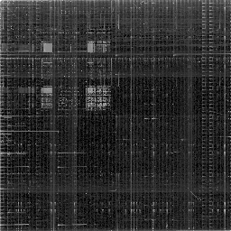

# Binary visualization

Basic implementation of a binary file visualization algorithm. The idea is to generate a visual representation of a binary file, in order to have a quick overview of its content.

Link to the [Christopher Domas's video](https://www.youtube.com/watch?v=4bM3Gut1hIk)

## How it works

> Here is the explanation of the `main.rs` file.

We get the raw byte data from a file :

```rust
let slice = load_file(file_path);
```

Then calculate a map (of 256x256 pixels) using slice parcour with a window size of 2 bytes :

```rust
let mut map = Map256::zeros();

generate_visualization(&slice, &mut map);
```

Finally, we generate an RGB image from the map and save it :

```rust
let img: RgbImage = map_to_image(&map);

img.save(&args.output).unwrap();
```

**Output example** (using rust exec as input) :

```bash
# run locally from the root of the project
cargo run -- -p ./target/debug/bvtool
```



## References

- [Christopher Domas - The future of RE Dynamic Binary Visualization](https://www.youtube.com/watch?v=4bM3Gut1hIk)
- [ppm P6 format](https://en.wikipedia.org/wiki/Netpbm) (for V0, now it's using png format)
- [Corte.si - entropy in raw bin files](https://corte.si/posts/visualisation/entropy/) (for next steps)

## Dataset

> WIP

Actually I'm working on creating a large and diverse dataset of binary files representations. It aims to be used for training a neural network to recognize the type of file from its visual representation or other applications.

- [\[IMG\] Car](https://www.kaggle.com/datasets/prondeau/the-car-connection-picture-dataset)
- [\[IMG\] Cat + Faces](https://www.kaggle.com/datasets/prasunroy/natural-images)
- [\[IMG\] Bitmap](https://www.kaggle.com/datasets/tobiasbueck/bitmap-appple)
- [\[AUDIO\] Speech emotions -> .wav](https://www.kaggle.com/datasets/dmitrybabko/speech-emotion-recognition-en)
- \[EXEC\] All my executables in my $PATH dirs (ARM)
